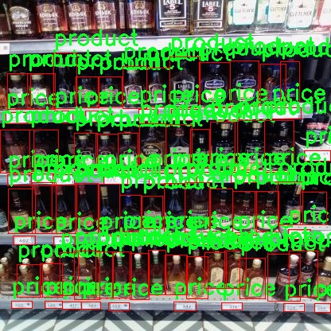

### 1.背景意义

研究背景与意义

随着全球酒类市场的迅速发展，消费者对酒类产品的需求日益增长，市场竞争也愈加激烈。在这种背景下，如何有效地识别和分类酒类产品，成为了酒类生产商、零售商及消费者关注的焦点。传统的酒类产品识别方法多依赖人工审核，不仅效率低下，而且容易受到人为因素的影响，导致识别结果的不准确性。因此，开发一种高效、准确的酒类产品识别系统显得尤为重要。

近年来，深度学习技术的快速发展为物体识别领域带来了革命性的变化。YOLO（You Only Look Once）系列模型因其高效的实时检测能力，已广泛应用于各种物体识别任务。YOLOv11作为该系列的最新版本，具备更强的特征提取能力和更快的处理速度，能够在复杂的环境中实现高精度的物体检测。基于YOLOv11的酒类产品识别系统，能够通过对酒类产品的图像进行实时分析，快速识别出产品的类别及价格信息，从而为消费者提供更为便捷的购物体验。

本研究所使用的数据集包含29张酒类产品的图像，涵盖了价格和产品两个主要类别。尽管数据集规模相对较小，但通过改进YOLOv11模型的训练和优化，可以有效提升模型在小样本情况下的识别能力。此外，结合数据增强技术，可以进一步丰富数据集，提升模型的泛化能力。

综上所述，基于改进YOLOv11的酒类产品识别系统，不仅具有重要的学术研究价值，还有助于推动酒类行业的智能化发展，提升市场竞争力，满足消费者日益增长的需求。通过本研究，期望能够为酒类产品的智能识别提供一种新的解决方案，为相关领域的研究提供参考。

### 2.视频效果

[2.1 视频效果](https://www.bilibili.com/video/BV1fkDzY5E8p/)

### 3.图片效果


##### [项目涉及的源码数据来源链接](https://kdocs.cn/l/cszuIiCKVNis)**

注意：本项目提供训练的数据集和训练教程,由于版本持续更新,暂不提供权重文件（best.pt）,请按照6.训练教程进行训练后实现上图演示的效果。

### 4.数据集信息

##### 4.1 本项目数据集类别数＆类别名

nc: 2
names: ['price', 'product']


该项目为【目标检测】数据集，请在【训练教程和Web端加载模型教程（第三步）】这一步的时候按照【目标检测】部分的教程来训练

##### 4.2 本项目数据集信息介绍

本项目数据集信息介绍

本项目所使用的数据集名为“Wine”，旨在为改进YOLOv11的酒类产品识别系统提供高质量的训练数据。该数据集包含两大类信息，分别是“price”和“product”，总计类别数量为2。这些类别不仅涵盖了酒类产品的基本特征，还提供了相关的市场信息，使得模型在识别酒类产品时能够更加全面和准确。

在数据集的构建过程中，我们注重了数据的多样性和代表性，确保所收集的样本能够覆盖不同类型的酒类产品，包括红酒、白酒、香槟等多种类别。每个样本都经过精心标注，确保“price”类别准确反映产品的市场价格，而“product”类别则详细描述了每种酒类的特征，如品牌、类型、产地等。这种细致的标注方式为模型的训练提供了丰富的信息，使其能够更好地理解和识别不同酒类产品的特征。

此外，数据集中的样本数量经过严格筛选，确保每个类别的样本均衡分布，从而避免模型在训练过程中出现偏差。我们还考虑到了数据的质量，所有样本均经过图像处理和清洗，以去除噪声和不必要的干扰因素。这一系列的措施旨在提升模型的泛化能力，使其在实际应用中能够准确识别各种酒类产品。

总之，“Wine”数据集不仅为YOLOv11的训练提供了坚实的基础，也为后续的研究和应用奠定了良好的数据支持。通过对该数据集的深入分析和应用，我们期望能够显著提升酒类产品识别系统的性能，为相关行业的智能化发展贡献力量。





### 5.全套项目环境部署视频教程（零基础手把手教学）

[5.1 所需软件PyCharm和Anaconda安装教程（第一步）](https://www.bilibili.com/video/BV1BoC1YCEKi/?spm_id_from=333.999.0.0&vd_source=bc9aec86d164b67a7004b996143742dc)


[5.2 安装Python虚拟环境创建和依赖库安装视频教程（第二步）](https://www.bilibili.com/video/BV1ZoC1YCEBw?spm_id_from=333.788.videopod.sections&vd_source=bc9aec86d164b67a7004b996143742dc)

### 6.改进YOLOv11训练教程和Web_UI前端加载模型教程（零基础手把手教学）

[6.1 改进YOLOv11训练教程和Web_UI前端加载模型教程（第三步）](https://www.bilibili.com/video/BV1BoC1YCEhR?spm_id_from=333.788.videopod.sections&vd_source=bc9aec86d164b67a7004b996143742dc)


按照上面的训练视频教程链接加载项目提供的数据集，运行train.py即可开始训练



     Epoch   gpu_mem       box       obj       cls    labels  img_size
     1/200     20.8G   0.01576   0.01955  0.007536        22      1280: 100%|██████████| 849/849 [14:42<00:00,  1.04s/it]
               Class     Images     Labels          P          R     mAP@.5 mAP@.5:.95: 100%|██████████| 213/213 [01:14<00:00,  2.87it/s]
                 all       3395      17314      0.994      0.957      0.0957      0.0843

     Epoch   gpu_mem       box       obj       cls    labels  img_size
     2/200     20.8G   0.01578   0.01923  0.007006        22      1280: 100%|██████████| 849/849 [14:44<00:00,  1.04s/it]
               Class     Images     Labels          P          R     mAP@.5 mAP@.5:.95: 100%|██████████| 213/213 [01:12<00:00,  2.95it/s]
                 all       3395      17314      0.996      0.956      0.0957      0.0845

     Epoch   gpu_mem       box       obj       cls    labels  img_size
     3/200     20.8G   0.01561    0.0191  0.006895        27      1280: 100%|██████████| 849/849 [10:56<00:00,  1.29it/s]
               Class     Images     Labels          P          R     mAP@.5 mAP@.5:.95: 100%|███████   | 187/213 [00:52<00:00,  4.04it/s]
                 all       3395      17314      0.996      0.957      0.0957      0.0845


###### [项目数据集下载链接](https://kdocs.cn/l/cszuIiCKVNis)

### 7.原始YOLOv11算法讲解

YOLOv11是一种由Ultralytics公司开发的最新一代目标检测模型，以其增强的特征提取能力和更高的效率在计算机视觉领域引人注目。该模型在架构上进行了关键升级，通过更新主干和颈部结构，显著提高了对复杂视觉场景的理解和处理精度。YOLOv11不仅在目标检测上表现出色，还支持实例分割、图像分类、姿态估计和定向目标检测（OBB）等任务，展示出其多功能性。

与其前身YOLOv8相比，YOLOv11在设计上实现了深度和宽度的改变，同时引入了几个创新机制。其中，C3k2机制是对YOLOv8中的C2f的改进，提升了浅层特征的处理能力；C2PSA机制则进一步优化了特征图的处理流程。解耦头的创新设计，通过增加两个深度卷积（DWConv），提高了模型对细节的感知能力和分类准确性。

在性能上，YOLOv11m模型在COCO数据集上的平均精度（mAP）提高，并减少了22%的参数量，确保了在运算效率上的突破。该模型可以部署在多种平台上，包括边缘设备、云平台以及支持NVIDIA GPU的系统，彰显出卓越的灵活性和适应性。总体而言，YOLOv11通过一系列的创新突破，对目标检测领域产生了深远的影响，并为未来的开发提供了新的研究方向。


****文档**** ： _ _https://docs.ultralytics.com/models/yolo11/__

****代码链接**** ： _ _https://github.com/ultralytics/ultralytics__

******Performance Metrics******


​ ** **关键特性****

****◆**** ** **增强的特征提取能力**** ：YOLO11采用了改进的主干和颈部架构，增强了 ** **特征提取****
能力，能够实现更精确的目标检测和复杂任务的执行。

****◆**** ** **优化的效率和速度****
：YOLO11引入了精细化的架构设计和优化的训练流程，提供更快的处理速度，并在准确性和性能之间保持最佳平衡。

****◆**** ** **参数更少、精度更高****
：通过模型设计的改进，YOLO11m在COCO数据集上实现了更高的平均精度（mAP），同时使用的参数比YOLOv8m少22%，使其在计算上更加高效，而不牺牲准确性。

****◆**** ** **跨环境的适应性**** ：YOLO11可以无缝部署在各种环境中，包括边缘设备、云平台和支持NVIDIA
GPU的系统，确保最大的灵活性。

****◆**** ** **支持广泛任务****
：无论是目标检测、实例分割、图像分类、姿态估计还是定向目标检测（OBB），YOLO11都旨在应对一系列计算机视觉挑战。

****支持的任务和模式****


​YOLO11建立在YOLOv8中引入的多功能模型范围之上，为各种计算机视觉任务提供增强的支持:


​该表提供了YOLO11模型变体的概述，展示了它们在特定任务中的适用性以及与Inference、Validation、Training和Export等操作模式的兼容性。从实时检测到复杂的分割任务
，这种灵活性使YOLO11适用于计算机视觉的广泛应用。

##### yolov11的创新

■ yolov8 VS yolov11

YOLOv5，YOLOv8和YOLOv11均是ultralytics公司的作品，ultralytics出品必属精品。


​ **具体创新点** ：

**① 深度（depth）和宽度 （width）**

YOLOv8和YOLOv11是基本上完全不同。

**② C3k2机制**

C3k2有参数为c3k，其中在网络的浅层c3k设置为False。C3k2就相当于YOLOv8中的C2f。


​ **③ C2PSA机制**

下图为C2PSA机制的原理图。


​ **④ 解耦头**

解耦头中的分类检测头增加了两个 **DWConv** 。


▲Conv

    
    
    def autopad(k, p=None, d=1):  # kernel, padding, dilation
    
        """Pad to 'same' shape outputs."""
    
        if d > 1:
    
            k = d * (k - 1) + 1 if isinstance(k, int) else [d * (x - 1) + 1 for x in k]  # actual kernel-size
    
        if p is None:
    
            p = k // 2 if isinstance(k, int) else [x // 2 for x in k]  # auto-pad
    
    return p
    
    
    class Conv(nn.Module):
    
        """Standard convolution with args(ch_in, ch_out, kernel, stride, padding, groups, dilation, activation)."""
    
    
        default_act = nn.SiLU()  # default activation
    
    
        def __init__(self, c1, c2, k=1, s=1, p=None, g=1, d=1, act=True):
    
            """Initialize Conv layer with given arguments including activation."""
    
            super().__init__()
    
            self.conv = nn.Conv2d(c1, c2, k, s, autopad(k, p, d), groups=g, dilation=d, bias=False)
    
            self.bn = nn.BatchNorm2d(c2)
    
            self.act = self.default_act if act is True else act if isinstance(act, nn.Module) else nn.Identity()
    
    
        def forward(self, x):
    
            """Apply convolution, batch normalization and activation to input tensor."""
    
            return self.act(self.bn(self.conv(x)))
    
    
        def forward_fuse(self, x):
    
            """Perform transposed convolution of 2D data."""
    
            return self.act(self.conv(x))

▲Conv2d

    
    
    torch.nn.Conv2d(in_channels, out_channels, kernel_size, stride=1, padding=0, dilation=1, groups=1, bias=True, padding_mode='zeros')

▲DWConv

DWConv ** **代表 Depthwise Convolution（深度卷积）****
，是一种在卷积神经网络中常用的高效卷积操作。它主要用于减少计算复杂度和参数量。

    
    
    class DWConv(Conv):
    
        """Depth-wise convolution."""
    
    
        def __init__(self, c1, c2, k=1, s=1, d=1, act=True):  # ch_in, ch_out, kernel, stride, dilation, activation
    
            """Initialize Depth-wise convolution with given parameters."""
    
            super().__init__(c1, c2, k, s, g=math.gcd(c1, c2), d=d, act=act)


### 8.200+种全套改进YOLOV11创新点原理讲解

#### 8.1 200+种全套改进YOLOV11创新点原理讲解大全

由于篇幅限制，每个创新点的具体原理讲解就不全部展开，具体见下列网址中的改进模块对应项目的技术原理博客网址【Blog】（创新点均为模块化搭建，原理适配YOLOv5~YOLOv11等各种版本）

[改进模块技术原理博客【Blog】网址链接](https://gitee.com/qunmasj/good)


#### 8.2 精选部分改进YOLOV11创新点原理讲解

###### 这里节选部分改进创新点展开原理讲解(完整的改进原理见上图和[改进模块技术原理博客链接](https://gitee.com/qunmasj/good)【如果此小节的图加载失败可以通过CSDN或者Github搜索该博客的标题访问原始博客，原始博客图片显示正常】

### 上下文引导网络（CGNet）简介


高准确率的模型（蓝点），由图像分类网络转化而来且参数量大，因此大多不适于移动设备。
低分辨率的小模型（红点），遵循分类网络的设计方式，忽略了分割特性，故而效果不好。
#### CGNet的设计：
为了提升准确率，用cgnet探索语义分割的固有属性。对于准确率的提升，因为语义分割是像素级分类和目标定位，所以空间依赖性和上下文信息发挥了重要作用。因此，设计cg模块，用于建模空间依赖性和语义上下文信息。
- 1、cg模块学习局部特征和周围特征形成联合特征
- 2、通过逐通道重新加权（强调有用信息，压缩无用信息），用全局特征改善联合特征
- 3、在全阶段应用cg模块，以便从语义层和空间层捕捉信息。
为了降低参数量：1、深层窄网络，尽可能节约内存 2、用通道卷积


之前的网络根据框架可分三类：
- 1、FCN-shape的模型，遵循分类网络的设计，忽略了上下文信息 ESPNet、ENet、fcn
- 2、FCN-CM模型，在编码阶段后用上下文模块捕捉语义级信息 DPC、DenseASPP、DFN、PSPNet
- 3、（our）在整个阶段捕捉上下文特征
- 4、主流分割网络的下采样为五次，学习了很多关于物体的抽象特征，丢失了很多有鉴别性的空间信息，导致分割边界过于平滑，（our）仅采用三次下采样，利于保存空间信息


#### cg模块

Cg模块：
思路：人类视觉系统依赖上下文信息理解场景。
如图3,a， 如若仅关注黄色框框，很难分辨，也就是说，仅关注局部特征不容易正确识别目标的类别。 然后，如果加入了目标周围的特征，即图3,b，就很容易识别正确，所以周围特征对于语义分割是很有帮助的。在此基础上，如果进一步用整个场景的特征加以辅助，将会有更高的程度去争正确分类黄色框框的物体，如图3,c所示。 故，周围上下文和全局上下文对于提升分割精度都是有帮助的。


实现：基于此，提出cg模块，利用局部特征，周围上下文以及全局上下文。如图3,d所示。该模块共包含两个阶段。

第一步，floc( ) 局部和 fsur( )周围函数分别学习对应特征。floc( )用3x3卷积从周围8个点提取特征，对应于黄色框框；同时fsur( )用感受野更大的3x3带孔卷积学习周围上下文，对应红色框框。然后fjoi( )是指将前两路特征concat之后经BN，PReLU。此一部分是cg模块的第一步。
对于模块的第二步，fglo( )用于提取全局特征，改善联合特征。受SENet启发，全局上下文被认为是一个加权向量，用于逐通道微调联合特征，以强调有用元素、压缩无用元素。在本论文中，fglo( )用GAP产生聚合上下文特征，然后用多层感知机进一步提取全局上下文。最后，使用一个尺度层对联合特征重新加权用提取的全局上下文。
残差连接有利于学习更复杂的特征以及便于训练时梯度反向传播。两个拟设计方案，LRL局部残差连接和GRL全局残差连接，实验证明（消融实验），GRL效果更好

#### CGNet网络


原则：深、瘦（deep and thin）以节省内存。层数少，通道数少，三个下采样。

Stage1，三个标准卷积层，分辨率变成原来的1/2

Stage2和stage3，分别堆叠M和N个cg模块。该两个阶段，第一层的输入是前一阶段第一个和最后一个block的结合（how结合）利于特征重用和特征传播。

将输入图像下采样到1/4和1/8分别输入到第2和3阶段。

最后，用1x1卷积层进行分割预测。

为进一步降低参数量，局部和周围特征提取器采用了逐通道卷积。之前有的工作在逐通道卷积后采用1x1卷积用以改善通道间的信息流动，本文消融实验显示效果不好，分析：因为cg模块中提取的局部和全局特征需要保持通道独立性，所以本论文不使用1*1卷积。


### 9.系统功能展示

图9.1.系统支持检测结果表格显示

  图9.2.系统支持置信度和IOU阈值手动调节

  图9.3.系统支持自定义加载权重文件best.pt(需要你通过步骤5中训练获得)

  图9.4.系统支持摄像头实时识别

  图9.5.系统支持图片识别

  图9.6.系统支持视频识别

  图9.7.系统支持识别结果文件自动保存

  图9.8.系统支持Excel导出检测结果数据


### 10. YOLOv11核心改进源码讲解

#### 10.1 transformer.py

以下是对给定代码的核心部分进行提炼和详细注释的结果：

```python
import torch
import torch.nn as nn
from functools import partial

# 引入自定义的模块
from .prepbn import RepBN, LinearNorm
from ..modules.transformer import TransformerEncoderLayer

# 定义模块的公开接口
__all__ = ['AIFI_RepBN']

# 定义线性归一化和RepBN的组合
ln = nn.LayerNorm
linearnorm = partial(LinearNorm, norm1=ln, norm2=RepBN, step=60000)

class TransformerEncoderLayer_RepBN(TransformerEncoderLayer):
    """使用RepBN的Transformer编码器层。"""
    
    def __init__(self, c1, cm=2048, num_heads=8, dropout=0, act=..., normalize_before=False):
        # 初始化父类
        super().__init__(c1, cm, num_heads, dropout, act, normalize_before)
        
        # 使用线性归一化和RepBN进行归一化
        self.norm1 = linearnorm(c1)
        self.norm2 = linearnorm(c1)

class AIFI_RepBN(TransformerEncoderLayer_RepBN):
    """定义AIFI Transformer层。"""

    def __init__(self, c1, cm=2048, num_heads=8, dropout=0, act=nn.GELU(), normalize_before=False):
        """初始化AIFI实例，设置参数。"""
        super().__init__(c1, cm, num_heads, dropout, act, normalize_before)

    def forward(self, x):
        """AIFI Transformer层的前向传播。"""
        c, h, w = x.shape[1:]  # 获取输入特征的通道数、高度和宽度
        pos_embed = self.build_2d_sincos_position_embedding(w, h, c)  # 构建位置嵌入
        
        # 将输入张量从[B, C, H, W]展平为[B, HxW, C]，并进行前向传播
        x = super().forward(x.flatten(2).permute(0, 2, 1), pos=pos_embed.to(device=x.device, dtype=x.dtype))
        
        # 将输出张量恢复为原始形状[B, C, H, W]
        return x.permute(0, 2, 1).view([-1, c, h, w]).contiguous()

    @staticmethod
    def build_2d_sincos_position_embedding(w, h, embed_dim=256, temperature=10000.0):
        """构建2D正弦-余弦位置嵌入。"""
        assert embed_dim % 4 == 0, "嵌入维度必须是4的倍数，以便进行2D正弦-余弦位置嵌入"
        
        # 创建网格坐标
        grid_w = torch.arange(w, dtype=torch.float32)
        grid_h = torch.arange(h, dtype=torch.float32)
        grid_w, grid_h = torch.meshgrid(grid_w, grid_h, indexing="ij")  # 生成网格
        
        pos_dim = embed_dim // 4  # 计算位置维度
        omega = torch.arange(pos_dim, dtype=torch.float32) / pos_dim
        omega = 1.0 / (temperature**omega)  # 计算频率

        # 计算位置嵌入
        out_w = grid_w.flatten()[..., None] @ omega[None]
        out_h = grid_h.flatten()[..., None] @ omega[None]

        # 返回拼接的正弦和余弦位置嵌入
        return torch.cat([torch.sin(out_w), torch.cos(out_w), torch.sin(out_h), torch.cos(out_h)], 1)[None]
```

### 代码核心部分分析
1. **模块导入**：导入必要的PyTorch模块和自定义模块。
2. **归一化设置**：使用`LinearNorm`和`RepBN`进行归一化的组合设置。
3. **Transformer编码器层**：定义了一个继承自`TransformerEncoderLayer`的类，增加了归一化层。
4. **AIFI Transformer层**：继承自`TransformerEncoderLayer_RepBN`，实现了前向传播和位置嵌入的构建。
5. **位置嵌入**：通过正弦和余弦函数构建2D位置嵌入，以增强模型对输入空间的理解。

### 代码功能
该代码实现了一个基于Transformer的网络层，结合了RepBN归一化方法，适用于处理图像等二维数据。通过构建位置嵌入，模型能够更好地捕捉输入数据的空间信息。

该文件 `transformer.py` 定义了一个基于 Transformer 的编码器层，特别是使用了改进的批归一化（RepBN）和线性归一化（LinearNorm）。文件中主要包含两个类：`TransformerEncoderLayer_RepBN` 和 `AIFI_RepBN`。

首先，文件导入了必要的 PyTorch 模块和功能，包括张量操作、神经网络模块和功能性操作。`functools.partial` 被用来创建一个部分应用的函数 `linearnorm`，该函数结合了线性归一化和 RepBN，后者是一种新的归一化方法，旨在提高模型的训练稳定性和性能。

`TransformerEncoderLayer_RepBN` 类继承自 `TransformerEncoderLayer`，并在其构造函数中初始化了两个归一化层 `norm1` 和 `norm2`，这两个层都使用了之前定义的 `linearnorm` 函数。这样做的目的是在 Transformer 编码器中引入新的归一化策略，以改善模型的表现。

接下来，`AIFI_RepBN` 类继承自 `TransformerEncoderLayer_RepBN`，并定义了一个特定的 Transformer 层，称为 AIFI（Adaptive Input Feature Integration）。在其构造函数中，除了调用父类的构造函数外，还可以指定激活函数（默认为 GELU）和其他参数。

在 `AIFI_RepBN` 类中，`forward` 方法实现了前向传播的逻辑。输入张量 `x` 的形状为 `[B, C, H, W]`，其中 B 是批量大小，C 是通道数，H 和 W 是高度和宽度。首先，方法调用 `build_2d_sincos_position_embedding` 来生成二维的正弦-余弦位置嵌入。然后，输入张量被展平并重新排列，以适应 Transformer 的输入格式。经过父类的前向传播后，输出张量被重新排列回原来的形状。

`build_2d_sincos_position_embedding` 是一个静态方法，用于生成二维的正弦-余弦位置嵌入。该方法首先检查嵌入维度是否可以被 4 整除，这是生成正弦和余弦嵌入的必要条件。接着，它创建了宽度和高度的网格，并计算出相应的正弦和余弦值，最终返回一个包含这些位置嵌入的张量。

总体而言，该文件实现了一个结合了新型归一化方法的 Transformer 编码器层，旨在提高模型在处理图像等高维数据时的性能。

#### 10.2 test_selective_scan.py

以下是经过简化和注释的核心代码部分，保留了最重要的功能和结构：

```python
import torch
import torch.nn.functional as F

def build_selective_scan_fn(selective_scan_cuda: object = None, mode="mamba_ssm"):
    """
    构建选择性扫描函数的工厂函数。
    
    参数:
    selective_scan_cuda: CUDA实现的选择性扫描函数。
    mode: 模式选择，决定使用哪种实现。
    
    返回:
    selective_scan_fn: 选择性扫描函数。
    """
    
    class SelectiveScanFn(torch.autograd.Function):
        @staticmethod
        def forward(ctx, u, delta, A, B, C, D=None, z=None, delta_bias=None, delta_softplus=False, return_last_state=False):
            """
            前向传播函数，计算选择性扫描的输出。
            
            参数:
            ctx: 上下文对象，用于保存状态。
            u, delta, A, B, C, D, z, delta_bias: 输入张量。
            delta_softplus: 是否使用softplus。
            return_last_state: 是否返回最后的状态。
            
            返回:
            out: 输出张量。
            last_state: 最后状态（可选）。
            """
            # 确保输入张量是连续的
            u = u.contiguous()
            delta = delta.contiguous()
            if D is not None:
                D = D.contiguous()
            B = B.contiguous()
            C = C.contiguous()
            if z is not None:
                z = z.contiguous()
            
            # 调用CUDA实现的前向函数
            out, x, *rest = selective_scan_cuda.fwd(u, delta, A, B, C, D, z, delta_bias, delta_softplus)
            
            # 保存输入张量以备后向传播使用
            ctx.save_for_backward(u, delta, A, B, C, D, z, delta_bias, x)
            last_state = x[:, :, -1, 1::2]  # 获取最后状态
            return (out, last_state) if return_last_state else out

        @staticmethod
        def backward(ctx, dout):
            """
            反向传播函数，计算梯度。
            
            参数:
            ctx: 上下文对象，包含前向传播时保存的状态。
            dout: 输出的梯度。
            
            返回:
            输入张量的梯度。
            """
            # 从上下文中恢复输入张量
            u, delta, A, B, C, D, z, delta_bias, x = ctx.saved_tensors
            
            # 调用CUDA实现的反向函数
            du, ddelta, dA, dB, dC, dD, ddelta_bias, *rest = selective_scan_cuda.bwd(u, delta, A, B, C, D, z, delta_bias, dout, x)
            
            return (du, ddelta, dA, dB, dC, dD, ddelta_bias)

    def selective_scan_fn(u, delta, A, B, C, D=None, z=None, delta_bias=None, delta_softplus=False, return_last_state=False):
        """
        选择性扫描函数的接口，调用自定义的前向和反向函数。
        
        参数:
        u, delta, A, B, C, D, z, delta_bias: 输入张量。
        delta_softplus: 是否使用softplus。
        return_last_state: 是否返回最后的状态。
        
        返回:
        outs: 输出张量或元组(out, last_state)。
        """
        outs = SelectiveScanFn.apply(u, delta, A, B, C, D, z, delta_bias, delta_softplus, return_last_state)
        return outs

    return selective_scan_fn

# 示例使用
selective_scan_fn = build_selective_scan_fn(selective_scan_cuda=None, mode="mamba_ssm")
```

### 代码注释说明
1. **build_selective_scan_fn**: 这是一个工厂函数，用于创建选择性扫描的函数。它接受一个CUDA实现和模式参数，并返回一个自定义的选择性扫描函数。
   
2. **SelectiveScanFn**: 这是一个继承自`torch.autograd.Function`的类，定义了前向和反向传播的逻辑。
   - **forward**: 计算选择性扫描的输出，处理输入张量并调用CUDA实现的前向函数。
   - **backward**: 计算输入张量的梯度，调用CUDA实现的反向函数。

3. **selective_scan_fn**: 这是一个接口函数，简化了对`SelectiveScanFn`的调用。

这个简化版本保留了选择性扫描的核心逻辑，并通过注释详细解释了每个部分的功能。

这个程序文件 `test_selective_scan.py` 是一个用于测试选择性扫描（Selective Scan）操作的 PyTorch 实现。文件中包含了多个函数和类，主要用于实现和验证选择性扫描的前向和反向传播过程。以下是对代码的详细说明。

首先，文件引入了一些必要的库，包括 `torch`、`torch.nn.functional`、`pytest` 等。接着，定义了一个常量 `SSOFLEX_FLOAT`，并设定为 `True`。

接下来，定义了一个 `build_selective_scan_fn` 函数，该函数接受一个 CUDA 实现的选择性扫描函数和一些参数，返回一个自定义的选择性扫描函数。这个函数内部定义了一个名为 `SelectiveScanFn` 的类，继承自 `torch.autograd.Function`，用于实现选择性扫描的前向和反向传播。

在 `SelectiveScanFn` 类中，`forward` 静态方法实现了前向传播逻辑。它接收多个输入参数，包括 `u`、`delta`、`A`、`B`、`C` 等，并对这些输入进行了一系列的处理，比如确保输入是连续的、调整维度、类型转换等。根据不同的模式（如 `mamba_ssm`、`ssoflex` 等），调用相应的 CUDA 函数进行计算，并将结果保存到上下文中以便后续的反向传播使用。

`backward` 静态方法实现了反向传播逻辑，计算梯度并返回。它从上下文中获取保存的张量，并根据不同的模式调用相应的 CUDA 函数来计算梯度。

接下来，定义了 `selective_scan_fn` 函数，这是一个对外接口，用户可以通过它来调用选择性扫描的功能。它会调用 `SelectiveScanFn.apply` 方法，并根据模式返回相应的输出。

文件中还定义了两个参考实现函数 `selective_scan_ref` 和 `selective_scan_ref_v2`，这些函数实现了选择性扫描的基本逻辑，用于与 CUDA 实现的结果进行比较。

在文件的后半部分，定义了一个 `test_selective_scan` 测试函数，使用 `pytest` 框架进行参数化测试。这个测试函数会生成各种输入数据，调用选择性扫描函数，并与参考实现的结果进行比较，确保两者在数值上是相近的。测试过程中还会检查梯度的正确性。

最后，文件根据不同的模式导入相应的 CUDA 实现，并设置了相关的参数。程序运行时会打印出当前使用的模式。

总体来说，这个文件实现了选择性扫描的功能，并通过测试确保其正确性，适用于深度学习模型中的序列数据处理。

#### 10.3 hcfnet.py

以下是经过简化和注释的核心代码部分：

```python
import torch
import torch.nn as nn
import torch.nn.functional as F

class SpatialAttentionModule(nn.Module):
    def __init__(self):
        super(SpatialAttentionModule, self).__init__()
        # 定义一个卷积层，用于生成空间注意力图
        self.conv2d = nn.Conv2d(in_channels=2, out_channels=1, kernel_size=7, stride=1, padding=3)
        self.sigmoid = nn.Sigmoid()  # 使用Sigmoid激活函数将输出限制在0到1之间

    def forward(self, x):
        # 计算输入特征图的平均值和最大值
        avgout = torch.mean(x, dim=1, keepdim=True)  # 平均池化
        maxout, _ = torch.max(x, dim=1, keepdim=True)  # 最大池化
        out = torch.cat([avgout, maxout], dim=1)  # 将平均值和最大值拼接
        out = self.sigmoid(self.conv2d(out))  # 通过卷积和Sigmoid生成注意力图
        return out * x  # 将注意力图应用于输入特征图

class PPA(nn.Module):
    def __init__(self, in_features, filters):
        super().__init__()
        # 定义多个卷积层和注意力模块
        self.skip = nn.Conv2d(in_features, filters, kernel_size=1)  # 跳跃连接
        self.c1 = nn.Conv2d(filters, filters, kernel_size=3, padding=1)
        self.c2 = nn.Conv2d(filters, filters, kernel_size=3, padding=1)
        self.c3 = nn.Conv2d(filters, filters, kernel_size=3, padding=1)
        self.sa = SpatialAttentionModule()  # 空间注意力模块
        self.drop = nn.Dropout2d(0.1)  # Dropout层
        self.bn1 = nn.BatchNorm2d(filters)  # 批归一化
        self.silu = nn.SiLU()  # SiLU激活函数

    def forward(self, x):
        # 通过卷积和跳跃连接处理输入
        x_skip = self.skip(x)  # 跳跃连接
        x1 = self.c1(x)
        x2 = self.c2(x1)
        x3 = self.c3(x2)
        # 将所有输出相加
        x = x1 + x2 + x3 + x_skip
        x = self.sa(x)  # 应用空间注意力
        x = self.drop(x)  # 应用Dropout
        x = self.bn1(x)  # 批归一化
        x = self.silu(x)  # 激活
        return x  # 返回最终输出

class DASI(nn.Module):
    def __init__(self, in_features, out_features):
        super().__init__()
        self.tail_conv = nn.Conv2d(out_features, out_features, kernel_size=1)  # 尾部卷积
        self.skips = nn.Conv2d(in_features[1], out_features, kernel_size=1)  # 跳跃连接
        self.silu = nn.SiLU()  # SiLU激活函数

    def forward(self, x_list):
        # 接收多个输入特征图
        x_low, x, x_high = x_list
        x = self.skips(x)  # 应用跳跃连接
        x_skip = x  # 保存跳跃连接的输出
        x = torch.chunk(x, 4, dim=1)  # 将输出分成4个部分
        # 处理不同分辨率的特征图
        if x_high is not None:
            x_high = self.skips(x_high)
            x_high = torch.chunk(x_high, 4, dim=1)
        if x_low is not None:
            x_low = self.skips(x_low)
            x_low = F.interpolate(x_low, size=[x.size(2), x.size(3)], mode='bilinear', align_corners=True)
            x_low = torch.chunk(x_low, 4, dim=1)
        # 结合低分辨率和高分辨率特征图
        x0 = x[0] + (x_low[0] if x_low is not None else 0) + (x_high[0] if x_high is not None else 0)
        x = torch.cat((x0, x[1], x[2], x[3]), dim=1)  # 拼接所有部分
        x = self.tail_conv(x)  # 尾部卷积
        x += x_skip  # 添加跳跃连接
        x = self.silu(x)  # 激活
        return x  # 返回最终输出
```

### 代码说明：
1. **SpatialAttentionModule**: 该模块计算输入特征图的空间注意力，通过平均池化和最大池化生成两个特征图，然后通过卷积和Sigmoid激活函数生成注意力图，最后将注意力图应用于输入特征图。

2. **PPA**: 该模块使用多个卷积层和空间注意力模块处理输入特征图。它通过跳跃连接、卷积和激活函数生成最终输出。

3. **DASI**: 该模块接收多个输入特征图，应用跳跃连接和卷积，结合不同分辨率的特征图，最后生成输出。

这个程序文件 `hcfnet.py` 实现了一个深度学习模型，主要用于图像处理任务。文件中定义了多个类，每个类实现了特定的功能模块，下面对这些模块进行逐一说明。

首先，文件导入了必要的库，包括 `math`、`torch` 及其子模块 `nn` 和 `functional`，并且从其他模块中引入了 `Conv` 类。接下来，定义了几个重要的类。

`SpatialAttentionModule` 类实现了空间注意力机制。它通过计算输入特征图的平均值和最大值来生成注意力图，然后通过卷积层和 Sigmoid 激活函数将其映射到与输入相同的维度。最终的输出是输入特征图与注意力图的逐元素相乘，增强了重要区域的特征。

`LocalGlobalAttention` 类则结合了局部和全局注意力机制。它首先将输入特征图分割成小块，计算每个小块的特征表示，并通过多层感知机（MLP）进行处理。接着，使用 softmax 函数计算局部注意力权重，并通过余弦相似度与可学习的提示向量进行结合，最终生成增强的特征图。这个模块能够有效地捕捉局部特征并与全局信息结合。

`ECA` 类实现了有效的通道注意力机制。它使用自适应平均池化和一维卷积来生成通道权重，并通过 Sigmoid 激活函数输出，最后将这些权重应用于输入特征图，增强了重要通道的特征。

`PPA` 类是一个复合模块，结合了多个子模块，包括跳跃连接、卷积层、空间注意力模块和通道注意力模块。它通过多个卷积层对输入进行处理，并通过局部全局注意力模块提取更丰富的特征，最后经过批归一化和激活函数处理后输出。

`Bag` 类实现了一个简单的加权融合机制，通过计算边缘注意力来加权输入特征图和其他特征图的组合，增强了模型的表达能力。

`DASI` 类是一个更复杂的模块，负责将多个输入特征图进行融合。它使用多个卷积层和跳跃连接，将高、中、低不同层次的特征进行处理，并通过 `Bag` 类进行加权融合，最终输出经过批归一化和激活函数处理的特征图。

整体来看，这个文件实现了一个结合了多种注意力机制和特征融合策略的深度学习模型，旨在提高图像处理任务中的特征提取能力和表现。通过不同的模块组合，模型能够更好地捕捉图像中的重要信息，适应不同的输入特征。

#### 10.4 shiftwise_conv.py

以下是代码中最核心的部分，并附上详细的中文注释：

```python
import math
import torch
import torch.nn as nn
import torch.nn.functional as F

class Mask(nn.Module):
    def __init__(self, size):
        super().__init__()
        # 初始化一个可学习的参数weight，范围在-1到1之间
        self.weight = torch.nn.Parameter(data=torch.Tensor(*size), requires_grad=True)
        self.weight.data.uniform_(-1, 1)

    def forward(self, x):
        # 对weight进行sigmoid激活，得到一个0到1之间的mask
        w = torch.sigmoid(self.weight)
        # 将输入x与mask相乘，得到加权后的输出
        masked_wt = w.mul(x)
        return masked_wt

class LoRAConvsByWeight(nn.Module):
    def __init__(self, in_channels: int, out_channels: int, big_kernel, small_kernel, stride=1, group=1, bn=True, use_small_conv=True):
        super().__init__()
        self.kernels = (small_kernel, big_kernel)  # 存储小卷积核和大卷积核的大小
        self.stride = stride
        self.small_conv = use_small_conv
        # 计算填充和索引
        padding, after_padding_index, index = self.shift(self.kernels)
        self.pad = padding, after_padding_index, index
        self.nk = math.ceil(big_kernel / small_kernel)  # 计算需要的卷积核数量
        out_n = out_channels * self.nk  # 输出通道数
        # 定义分离卷积层
        self.split_convs = nn.Conv2d(in_channels, out_n, kernel_size=small_kernel, stride=stride, padding=padding, groups=group, bias=False)

        # 定义两个Mask层
        self.lora1 = Mask((1, out_n, 1, 1))
        self.lora2 = Mask((1, out_n, 1, 1))
        self.use_bn = bn

        # 如果需要，定义BatchNorm层
        if bn:
            self.bn_lora1 = nn.BatchNorm2d(out_channels)
            self.bn_lora2 = nn.BatchNorm2d(out_channels)
        else:
            self.bn_lora1 = None
            self.bn_lora2 = None

    def forward(self, inputs):
        # 通过分离卷积层处理输入
        out = self.split_convs(inputs)
        *_, ori_h, ori_w = inputs.shape  # 获取输入的高度和宽度
        # 通过两个Mask层进行处理
        lora1_x = self.forward_lora(self.lora1(out), ori_h, ori_w, VH='H', bn=self.bn_lora1)
        lora2_x = self.forward_lora(self.lora2(out), ori_h, ori_w, VH='W', bn=self.bn_lora2)
        # 将两个结果相加
        x = lora1_x + lora2_x
        return x

    def forward_lora(self, out, ori_h, ori_w, VH='H', bn=None):
        # 沿着每个组的索引进行分割
        b, c, h, w = out.shape
        out = torch.split(out.reshape(b, -1, self.nk, h, w), 1, 2)  # 将输出分割成多个部分
        x = 0
        for i in range(self.nk):
            outi = self.rearrange_data(out[i], i, ori_h, ori_w, VH)  # 重新排列数据
            x = x + outi  # 累加结果
        if self.use_bn:
            x = bn(x)  # 如果需要，进行BatchNorm处理
        return x

    def rearrange_data(self, x, idx, ori_h, ori_w, VH):
        # 重新排列数据以适应卷积操作
        padding, _, index = self.pad
        x = x.squeeze(2)  # 去掉多余的维度
        *_, h, w = x.shape
        k = min(self.kernels)
        ori_k = max(self.kernels)
        ori_p = ori_k // 2
        stride = self.stride
        # 计算填充和起始点
        if (idx + 1) >= index:
            pad_l = 0
            s = (idx + 1 - index) * (k // stride)
        else:
            pad_l = (index - 1 - idx) * (k // stride)
            s = 0
        if VH == 'H':
            suppose_len = (ori_w + 2 * ori_p - ori_k) // stride + 1
            pad_r = 0 if (s + suppose_len) <= (w + pad_l) else s + suppose_len - w - pad_l
            new_pad = (pad_l, pad_r, 0, 0)
            dim = 3
        else:
            suppose_len = (ori_h + 2 * ori_p - ori_k) // stride + 1
            pad_r = 0 if (s + suppose_len) <= (h + pad_l) else s + suppose_len - h - pad_l
            new_pad = (0, 0, pad_l, pad_r)
            dim = 2
        if len(set(new_pad)) > 1:
            x = F.pad(x, new_pad)  # 进行填充
        if padding * 2 + 1 != k:
            pad = padding - k // 2
            if VH == 'H':
                x = torch.narrow(x, 2, pad, h - 2 * pad)
            else:
                x = torch.narrow(x, 3, pad, w - 2 * pad)

        xs = torch.narrow(x, dim, s, suppose_len)  # 按照计算的起始点和长度进行切片
        return xs

    def shift(self, kernels):
        # 计算填充和窗口的起始点
        mink, maxk = min(kernels), max(kernels)
        mid_p = maxk // 2
        offset_idx_left = mid_p % mink
        offset_idx_right = (math.ceil(maxk / mink) * mink - mid_p - 1) % mink
        padding = offset_idx_left % mink
        while padding < offset_idx_right:
            padding += mink
        while padding < (mink - 1):
            padding += mink
        after_padding_index = padding - offset_idx_left
        index = math.ceil((mid_p + 1) / mink)
        real_start_idx = index - after_padding_index // mink
        return padding, after_padding_index, real_start_idx

class ReparamLargeKernelConv(nn.Module):
    def __init__(self, in_channels, out_channels, kernel_size, small_kernel=5, stride=1, groups=1, small_kernel_merged=False, Decom=True, bn=True):
        super(ReparamLargeKernelConv, self).__init__()
        self.kernel_size = kernel_size
        self.small_kernel = small_kernel
        self.Decom = Decom
        padding = kernel_size // 2  # 计算填充
        if small_kernel_merged:  # 如果使用合并的小卷积
            self.lkb_reparam = nn.Conv2d(in_channels, out_channels, kernel_size=kernel_size, stride=stride, padding=padding, dilation=1, groups=groups, bias=True)
        else:
            if self.Decom:
                self.LoRA = conv_bn(in_channels=in_channels, out_channels=out_channels, kernel_size=(kernel_size, small_kernel), stride=stride, padding=padding, dilation=1, groups=groups, bn=bn)
            else:
                self.lkb_origin = conv_bn(in_channels=in_channels, out_channels=out_channels, kernel_size=kernel_size, stride=stride, padding=padding, dilation=1, groups=groups, bn=bn)

            if (small_kernel is not None) and small_kernel < kernel_size:
                self.small_conv = conv_bn(in_channels=in_channels, out_channels=out_channels, kernel_size=small_kernel, stride=stride, padding=small_kernel // 2, groups=groups, dilation=1, bn=bn)

        self.bn = nn.BatchNorm2d(out_channels)  # 定义BatchNorm层
        self.act = nn.SiLU()  # 定义激活函数

    def forward(self, inputs):
        # 前向传播
        if hasattr(self, "lkb_reparam"):
            out = self.lkb_reparam(inputs)
        elif self.Decom:
            out = self.LoRA(inputs)
            if hasattr(self, "small_conv"):
                out += self.small_conv(inputs)
        else:
            out = self.lkb_origin(inputs)
            if hasattr(self, "small_conv"):
                out += self.small_conv(inputs)
        return self.act(self.bn(out))  # 返回经过BatchNorm和激活函数处理的输出

    def get_equivalent_kernel_bias(self):
        # 获取等效的卷积核和偏置
        eq_k, eq_b = fuse_bn(self.lkb_origin.conv, self.lkb_origin.bn)
        if hasattr(self, "small_conv"):
            small_k, small_b = fuse_bn(self.small_conv.conv, self.small_conv.bn)
            eq_b += small_b
            eq_k += nn.functional.pad(small_k, [(self.kernel_size - self.small_kernel) // 2] * 4)
        return eq_k, eq_b

    def switch_to_deploy(self):
        # 切换到部署模式
        if hasattr(self, 'lkb_origin'):
            eq_k, eq_b = self.get_equivalent_kernel_bias()
            self.lkb_reparam = nn.Conv2d(in_channels=self.lkb_origin.conv.in_channels, out_channels=self.lkb_origin.conv.out_channels, kernel_size=self.lkb_origin.conv.kernel_size, stride=self.lkb_origin.conv.stride, padding=self.lkb_origin.conv.padding, dilation=self.lkb_origin.conv.dilation, groups=self.lkb_origin.conv.groups, bias=True)
            self.lkb_reparam.weight.data = eq_k
            self.lkb_reparam.bias.data = eq_b
            self.__delattr__("lkb_origin")
            if hasattr(self, "small_conv"):
                self.__delattr__("small_conv")
```

### 代码核心部分解释：
1. **Mask类**：用于创建一个可学习的mask，通过sigmoid函数将权重限制在0到1之间，然后与输入进行逐元素相乘，实现加权效果。

2. **LoRAConvsByWeight类**：实现了通过小卷积核和大卷积核进行特征提取的逻辑。该类的核心在于通过`forward`方法对输入进行处理，利用mask进行加权，并且通过`rearrange_data`方法调整数据的排列方式。

3. **ReparamLargeKernelConv类**：实现了一个重参数化的大卷积核卷积层。根据输入参数选择使用合并的小卷积核或分解的卷积结构，并在前向传播中处理输入数据，最终返回经过BatchNorm和激活函数处理的输出。

4. **fuse_bn函数**：用于将卷积层和BatchNorm层融合为一个卷积层，以提高推理速度。

这些核心部分共同构成了一个灵活且高效的卷积层设计，能够处理不同大小的卷积核并进行有效的特征提取。

这个程序文件 `shiftwise_conv.py` 实现了一个用于卷积神经网络的模块，主要涉及大核卷积和小核卷积的组合以及相关的参数重参数化。文件中定义了多个类和函数，主要功能包括卷积层的创建、批归一化、掩码操作以及卷积的前向传播等。

首先，文件中导入了必要的库，包括 `torch` 和 `torch.nn`，这些是构建深度学习模型的基础库。接着，定义了一个函数 `get_conv2d`，用于创建二维卷积层。这个函数接收多个参数，如输入通道数、输出通道数、卷积核大小、步幅、填充、扩张、分组和偏置等，返回一个 `nn.Conv2d` 对象。

接下来，定义了一个 `Mask` 类，该类用于创建一个可学习的掩码。掩码的权重通过 sigmoid 函数进行归一化，然后与输入相乘，从而实现对输入的加权操作。

`conv_bn_ori` 函数用于创建一个包含卷积层和可选的批归一化层的序列。它根据输入参数生成相应的卷积层，并在需要时添加批归一化层。

`LoRAConvsByWeight` 类实现了通过权重合并小核和大核卷积的功能。它在初始化时设置了多个卷积层和掩码，并在前向传播中计算出经过掩码处理的输出。该类的设计允许在卷积操作中根据权重进行通道的重排，从而实现更灵活的特征提取。

`ReparamLargeKernelConv` 类是文件的核心部分，它实现了大核卷积的重参数化。根据输入参数，选择是否使用小核卷积，并在前向传播中计算最终的输出。该类还实现了一个 `get_equivalent_kernel_bias` 方法，用于获取等效的卷积核和偏置，以便在推理阶段使用。

最后，`switch_to_deploy` 方法用于在模型部署时转换为更高效的卷积层。它通过获取等效的卷积核和偏置，创建一个新的卷积层并替换掉原有的卷积层，从而减少推理时的计算开销。

总体而言，这个文件实现了一个复杂的卷积模块，支持多种卷积操作的组合和优化，适用于需要高效卷积计算的深度学习任务。

### 11.完整训练+Web前端界面+200+种全套创新点源码、数据集获取


# [下载链接：https://mbd.pub/o/bread/Z5WZm5pq](https://mbd.pub/o/bread/Z5WZm5pq)